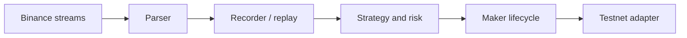

# AnchorBell: Binance Equity Perpetual Anchor-Maker Engine

<p align="center">
<<<<<<< HEAD
  <strong>Anchor the close. Quote the deviation. Flatten before reopen.</strong><br>
  A Rust-first, maker-only industrial quantitative service for controlled Testnet/Production execution.
=======
  <strong>Research the close. Quote the deviation. Reduce risk before the deadline.</strong><br>
  A Rust-first, maker-only engine for Binance equity perpetual research and controlled Testnet/Production execution.
>>>>>>> refs/remotes/github/codex/safety-core
</p>

<p align="center">
  <strong>English</strong> · <a href="README.zh-CN.md">简体中文</a>
</p>

<p align="center">
  <a href="#quick-start">Quick Start</a> ·
  <a href="docs/TESTNET_RUNBOOK.md">Testnet Runbook</a> ·
  <a href="docs/SIMULATION_RUNTIME.md">Simulation / Replay</a> ·
  <a href="docs/DUAL_ENVIRONMENT_RUNBOOK.md">Dual Environment</a> ·
  <a href="docs/ARCHITECTURE.md">Architecture</a> ·
  <a href="docs/PLATFORM_SYSTEM_CATALOG.md">System Catalog</a> ·
  <a href="docs/ROADMAP.md">Roadmap</a>
</p>

<p align="center">
  <a href="https://www.rust-lang.org/"></a>
  <a href="LICENSE"></a>
  <a href="https://www.binance.com/"></a>
  <a href="docs/TESTNET_AND_BACKTEST.md"></a>
</p>

AnchorBell is a Rust-first, maker-only Binance equity perpetual quantitative service for
live-market data, isolated simulation, historical replay, controlled Testnet and
explicitly gated Production execution, risk controls, order lifecycle management,
recovery, and observability.

It is an engineering platform, not a promise of arbitrage or profit. Every result must
state its data, latency, fill, fee, and risk assumptions.

## What AnchorBell does

During the underlying equity market's closed session, a perpetual contract may
deviate from the last reliable equity-market close. AnchorBell models that close
as a static anchor, evaluates the deviation, places only passive post-only quotes,
and targets passive reduction before the underlying market reopens or the next
funding-risk deadline. Unfilled residual exposure is reported, never treated as
a synthetic fill.

The system is intentionally narrow:

- Binance equity perpetual contracts.
- Maker-only entry and exit.
- Static closing-price anchor with explicit validity.
- Hong Kong issuers with active ADR/ADS price discovery are excluded from the FrozenClose strategy; weak or stale OTC programs are recorded but do not become the anchor.
- Short-lived exposure inside a defined session window.
- Integer price and quantity ticks at execution boundaries.
- Deterministic replay using the same strategy and risk contracts.
## Architecture

AnchorBell separates market data, strategy, risk, execution, replay, and
exchange adapters. No strategy module is allowed to discover credentials,
open sockets, or mutate exchange state directly.



The critical boundaries are:

| Boundary | Responsibility |
| --- | --- |
| `market` | Parse Binance events, validate decimals, subscribe, and record input |
| `strategy` | Anchor, session, quote, and inventory decisions |
| `execution` | Order intent, lifecycle, risk gate, credentials, and transport contracts |
| `replay` | Timestamp-ordered historical event ingestion |
| `backtest` | Explicit fill assumptions and integer-tick result handling |
| `runtime` | Composition and event-loop integration |

Composition happens at the edges. The core remains usable with simulation gateways,
recorded data, or a future Binance network adapter.
## Design principles

1. Maker-only is a hard invariant, not a best-effort preference.
2. The engine targets passive reduction before the earliest risk deadline and
   explicitly reports any unfilled residual exposure.
3. Invalid anchors, stale data, and exceeded position limits fail closed.
4. Testnet and production endpoints are different typed environments.
5. Credentials are read from the environment or the Windows user credential store and never committed.
6. Exchange effects are acknowledged through explicit lifecycle events.
7. Historical replay is deterministic and rejects out-of-order input.
8. Backtest fills state their assumptions instead of pretending to be executions.
9. Integer ticks are used where precision affects decisions or accounting.
10. Performance optimizations must preserve strategy and risk semantics.

## Testnet and backtesting

The project includes explicit Binance Testnet and Production endpoint configuration,
a typed signed order transport boundary, JSONL market recording, event replay, and
runnable simulation/backtest/Testnet runners. The deterministic simulation fill model requires an exact quote-price match and
compatible aggTrade aggressor; Production is never selected by default.

Testnet can validate authentication, filters, post-only rejects, cancellations,
reconnect behavior, and exchange acknowledgements. It cannot establish live
profitability or reproduce historical liquidity.

Kline-only backtests are insufficient for this maker strategy. A serious replay
should include bookTicker, mark price, anchor snapshots, local receipt timestamps,
latency, queue assumptions, cancel timing, fees, and funding treatment.

See the [simulation/replay/Testnet runner runbook](docs/SIMULATION_RUNTIME.md), [Testnet and historical replay](docs/TESTNET_AND_BACKTEST.md), the [Futures Testnet runbook](docs/TESTNET_RUNBOOK.md), the [Spot Demo runbook](docs/SPOT_DEMO_RUNBOOK.md), the [GNU toolchain build runbook](docs/BUILD_GNU_TOOLCHAIN.md), the [Hong Kong ADR/ADS exclusion register](docs/HONG_KONG_ADR_EXCLUSION.md), and the [project roadmap](docs/ROADMAP.md).
## Quick start

The current engine is a Rust workspace. The local control console is served by
Rust on 127.0.0.1 only; it never exposes the dashboard to the network.

```powershell
git clone https://github.com/Xalzeroph/AnchorBell.git
cd AnchorBell
cargo test --workspace --locked
cargo run -p anchorbell-engine
cargo run -p anchorbell-engine --bin backtest_smoke --locked
cargo run -p anchorbell-engine --bin market_throughput_smoke --locked
cargo run -p anchorbell-engine --bin binance_metadata_smoke --locked
# Or double-click Start-AnchorBell-Dashboard.cmd to open the local control console.
# In the console, save credentials to the Windows user credential store; leave the
# credential fields empty on later session applies to load the selected environment.
# Only when the host network requires an HTTP CONNECT proxy:
$env:ANCHORBELL_HTTP_PROXY = "http://127.0.0.1:7890"
cargo run -p anchorbell-engine --bin testnet_market_smoke --locked
```

`testnet_market_smoke` is public-market-data only; it never submits an order.
`binance_metadata_smoke` checks public `exchangeInfo`, book ticker, mark price, index price,
funding metadata, and the required `PRICE_FILTER`, `LOT_SIZE`, `MIN_NOTIONAL`, and
`PERCENT_PRICE` filters for the reviewed execution universe; any missing, malformed, or
stale snapshot is reported as a fail-closed diagnostic. Batch public snapshots use bounded
concurrency. The dashboard's “元数据门禁” button performs the same read-only check for
the selected environment and symbol. The default production path is not enabled by the core. Before any testnet
run, set credentials only in the process environment or save them from the local dashboard into the Windows user credential store:

```powershell
$env:ANCHORBELL_BINANCE_API_KEY = "<testnet-key>"
$env:ANCHORBELL_BINANCE_API_SECRET = "<testnet-secret>"
```

Never place real keys in `.env`, source files, logs, issues, commits, or replay
artifacts. Use testnet credentials only until the complete network and recovery
verification is independently reviewed.

After credentials are injected, start with the read-only account and open-order smokes:

```powershell
cargo run -p anchorbell-engine --bin binance_account_smoke --locked
cargo run -p anchorbell-engine --bin binance_open_orders_smoke --locked
```

These generic commands use Testnet by default. They only send signed read-only account
and symbol-scoped open-order queries; they contain no order placement or cancellation.
For the exact Production read-only gate and credential names, see the
[dual-environment runbook](docs/DUAL_ENVIRONMENT_RUNBOOK.md).
## Repository layout

| Path | Responsibility |
| --- | --- |
| `engine/src/market/` | Binance parsing, subscriptions, and JSONL recording |
| `engine/src/strategy/` | Anchor, session, quote, and inventory policy |
| `engine/src/execution/` | Gateways, lifecycle, risk, credentials, Windows credential store, and order transport |
| `engine/web/` | Local dashboard HTML, CSS, and JavaScript |
| `Start-AnchorBell-Dashboard.cmd` | Double-click launcher for the local dashboard |
| `engine/src/replay.rs` | Typed historical event replay and incremental ingestion |
| `engine/src/backtest.rs` | Pluggable maker fill assumptions |
| `engine/src/backtest_report.rs` | Integer-tick backtest aggregation |
| `docs/` | Platform architecture, simulation, testnet, replay, and operating notes |
| `Cargo.toml` / `Cargo.lock` | Workspace and locked dependency definitions |
| `LICENSE` | Apache License 2.0 |
| `NOTICE` | Attribution and trademark notice |

## Verification

Run checks against the exact revision being evaluated:

```powershell
cargo fmt --all -- --check
cargo test --workspace --locked
cargo clippy --workspace --all-targets --all-features -- -D warnings
```

The repository contains the core contracts, live adapter boundaries, cryptographic
request signing, and focused safety tests. End-to-end exchange evidence is still a
separate operational gate and must not be inferred from unit tests alone. Production
read-only access is explicitly gated; order submission requires a second independent
switch and a deliberate confirmation string.
## Security and contribution boundaries

- Do not commit API keys, secrets, private keys, account identifiers, or raw
  authenticated payloads.
- Keep production activation behind an explicit safety policy.
- Do not weaken post-only, session-flatten, stale-data, or position-cap gates.
- Keep network I/O in adapters; keep strategy and risk deterministic.
- Add focused tests and documentation with every behavioral change.
- Use small commits that preserve one ownership boundary at a time.
- Report exact commit SHAs and exact test commands in reviews.

Issues and pull requests should include the symbol or boundary affected, the
reproduction input, the expected invariant, and the evidence used to verify it.

## License

AnchorBell is licensed under the [Apache License 2.0](LICENSE). See [NOTICE](NOTICE) for attribution and trademark context.

This repository is independent open-source quantitative infrastructure. Binance,
market-data providers, and any referenced third-party components remain subject
to their own terms. AnchorBell is not financial advice and does not guarantee
execution, liquidity, compliance, or returns.
