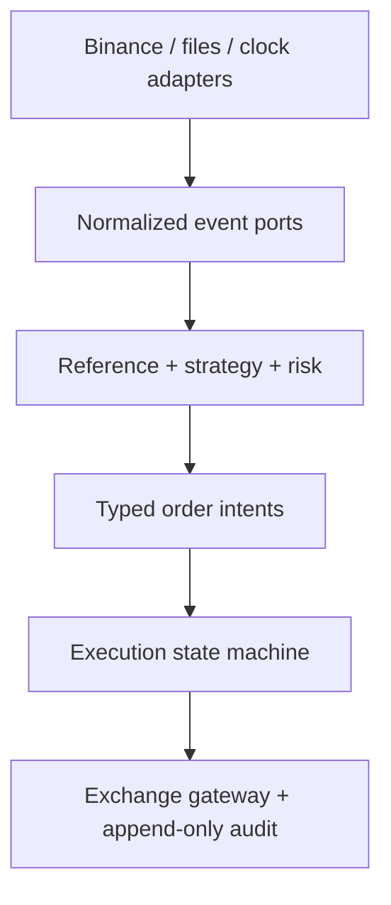

# AnchorBell architecture governance

This document is the review contract for changes that affect strategy, execution,
simulation, configuration, or evidence. It is deliberately stricter than a
style guide: a change is incomplete when its behavior cannot be reproduced and
audited from its declared inputs.

## 1. Ownership boundaries

The runtime is composed from these ownership domains:

| Domain | Owns | Must not own |
| --- | --- | --- |
| market | Binance event parsing, normalization, freshness, and recording | strategy choices or credentials |
| strategy | anchor, session, quote, inventory, and experiment decisions | sockets, credentials, or exchange mutations |
| risk | exposure limits, stale-data gates, deadlines, and permission decisions | order transport or hidden defaults |
| execution | order intent validation, lifecycle, reconciliation, and gateway calls | research labels or future information |
| replay / backtest | deterministic event ordering and explicit fill assumptions | production authorization |
| runtime | dependency composition, persistence, and observability | silently changing policy |

A module may depend on a lower-level contract only through its typed interface.
The strategy must be runnable against simulation, replay, and exchange adapters
without changing its decision semantics.

## 2. Configuration provenance

Business behavior must come from one of three declared sources:

1. live Binance metadata and exchange filters;
2. explicit user input captured by the control surface; or
3. versioned JSON/TOML configuration committed with the experiment or deployment.

Examples include fee schedules, symbol universes, session windows, funding
deadlines, quote policy, execution policy, and experiment variants. Rust source
may define types, validation, and safe absence behavior, but must not hide a
business value behind a production Default, an unexplained literal, or a
test-only fixture that can leak into runtime.

Every resolved configuration must carry its source, version or hash, and
effective timestamp. Unknown, stale, contradictory, or missing exchange data
fails closed.

## 3. Execution policy

Normal entry and reduction are maker-first and post-only. An emergency taker is
not a second strategy and never creates exposure. It must be:

- reduce-only and symbol/side bounded;
- registered in the resolved configuration;
- selected only after a causal feasibility/cost/safety decision;
- represented in the order intent and audit trail with its reason;
- disabled when its policy, exchange rules, or evidence are incomplete.

The policy must be adaptive to current deadline, queue/fill evidence, mark/index
quality, position state, and configured fees. Do not encode a fixed timeout or
fee assumption in the execution path.

## 4. Experiment and evidence contract

Each run must persist:

- immutable input/configuration identifiers and hashes;
- Binance rule and fee sources used at decision time;
- event and receipt-time windows, latency, and data-quality status;
- fill model, queue assumptions, funding treatment, and fee attribution;
- policy variant, emergency-taker activations, residual exposure, and reason codes;
- net PnL, drawdown, markout, turnover, costs, and invalid/insufficient-data states.

A result is not evidence that one module is best unless alternatives use the
same data, calendar, fee model, execution assumptions, seeds, and acceptance
gates. Promotion requires out-of-sample or replay evidence plus a reviewable
manifest; a higher return alone is not sufficient.

## 5. Review gates

Every behavioral change needs focused tests and documentation. Before merge:

- formatting, locked tests, clippy, and architecture/resource gates pass;
- no unresolved merge markers or secret material are present;
- configuration changes include schema/version and migration coverage;
- simulation, Testnet, and Production capability boundaries remain explicit;
- the exact commit, configuration hash, data window, and verification commands
  are recorded in the review.

This contract does not authorize Production order submission. Production remains
disabled until its independent operational gates are satisfied.

## 6. Target architecture and design patterns

The repository is intentionally moving toward a hexagonal, event-driven
architecture. The following patterns are mandatory boundaries, not decorative
terminology:

| Pattern | AnchorBell use | Constraint |
| --- | --- | --- |
| Hexagonal architecture | domain decisions depend on typed ports; Binance, files, and clocks are adapters | strategy and risk cannot import transport clients |
| Event-driven pipeline | normalized market, reference, decision, order, and lifecycle events | event time and receipt time remain separate |
| CQRS | decision queries/read models are separate from order/lifecycle commands | reports cannot mutate execution state |
| State machine | order lifecycle, recovery, readiness, and residual exposure use explicit states | unknown transitions fail closed |
| Policy object | fees, deadlines, maker/taker permissions, and risk limits are resolved policy values | policies are versioned inputs, not hidden constants |
| Registry/factory | method catalog, experiment plans, gateways, and adapters are registered once | no duplicated string-based dispatch |
| Anti-corruption layer | Binance wire payloads are normalized before entering the domain | exchange-specific fields do not leak through the core |
| Event-sourced audit | decisions and exchange acknowledgements are append-only evidence | a metric cannot rewrite an order fact |

The intended dependency direction is:

### Current structural pressure points

The main branch at the time of this review has approximately:

- 1,611 lines in platform.rs;
- 137 Rust source files under engine/src;
- multiple standalone binaries under engine/src/bin;
- dozens of historical repair scripts under .github/scripts.

These are not immediate correctness failures, but they increase change coupling,
review size, and the probability that a new method bypasses the common contracts.

### Refactoring sequence

1. Split platform.rs behind a stable facade into catalog, topology, health,
   readiness, manifest, and policy modules. Preserve public types and tests
   during each extraction.
2. Introduce one typed application runner with subcommands for simulation,
   replay, backtest, metadata smoke, and controlled Testnet checks. Keep old
   binaries as thin compatibility wrappers until the runner is proven.
3. Move reusable repair scripts into a versioned tools/migrations area with
   manifests, idempotence checks, and tests. Delete only after their result is
   represented by a permanent invariant or migration.
4. Make configuration resolution a boot-time pipeline:
   source discovery -> schema validation -> exchange enrichment -> merge policy
   -> digest -> immutable runtime snapshot.
5. Make every runtime capability depend on a readiness token issued by the
   platform registry. Readiness must be capability-specific; data readiness
   cannot imply order permission.
6. Keep analytics and validation downstream of immutable run artifacts. They may
   consume evidence, but cannot become an authority for live execution.

The safe migration rule is one bounded extraction per change, with unchanged
serialized manifests and deterministic replay results. A refactor that changes
behavior and structure in the same commit is rejected unless both differences
are explicitly evidenced.

## 7. Runtime snapshot and capability model

At startup, the runtime should resolve one immutable snapshot containing:

- configuration sources and digests;
- Binance exchange metadata and filter versions;
- fee and funding schedules;
- strategy/method and execution overlay;
- clock, data, queue, latency, and fill-model capabilities;
- risk and production permission state.

Components receive only the slice they own. They do not re-read mutable global
configuration during a decision. A capability token should distinguish at
least:

| Capability | Allows | Does not imply |
| --- | --- | --- |
| MarketDataReady | parse and record market events | valid anchor or order permission |
| StrategyReady | calculate a decision | order submission |
| SimulationReady | run deterministic simulation | Testnet or Production access |
| TestnetReady | use the Testnet adapter | Production access |
| ReduceOnlyRecovery | lower existing exposure | create new exposure |
| ProductionOrder | submit authorized orders | permission to bypass risk gates |

This prevents the common architectural error where one boolean such as
`ready=true` accidentally authorizes unrelated capabilities.

## 8. Long-term quality bar

A high-star repository should make the safe path the easy path:

- one documented command per lifecycle phase;
- one manifest schema for every run;
- one source of truth for each business policy;
- one typed boundary for each external system;
- one review checklist that matches the actual gates;
- one reproducible release procedure;
- no dead compatibility path without an owner and removal condition.

The repository should prefer a small number of strong concepts over a large
number of clever modules. New abstractions are accepted only when they remove
coupling, encode an invariant, or make evidence reproducible.
